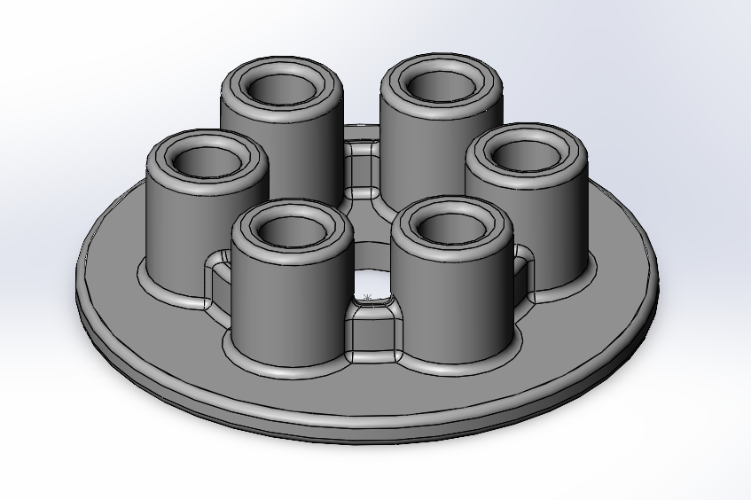

# Gün 1 — Pressure Plate (İlk Parçam)

Dahili öğretici: `Başlarken > SOLIDWORKS'e Giriş > İlk Parçam` (25 sayfa)
Tarih: 17 Ağustos 2026 · Sürüm: SOLIDWORKS Premium 2025 SP1.2 · Birim: MMGS · Taslak standardı: ANSI

## Unsur ağacı ve ölçüler

| # | Unsur | Ölçü / ayar | Not |
|---|---|---|---|
| 1 | `Extrude1` | Ø128, derinlik 7 mm | Üst düzlem, Kör. Merkez orijinde. |
| 2 | `Extrude2` | Ø75 dış, 5 mm içe öteleme, derinlik 12 mm | Halka. Orijinden başladığı için taban ile **eşmerkezli** |
| 3 | `Cut-Extrude1` | Ø25, Tümü Boyunca | Merkez delik |
| 4 | `Fillet1` | R2, sabit boyutlu | Halka üst yüzü + taban dış yüzü |
| 5 | `Extrude3` | Ø27, merkezden 35 mm, derinlik 30 mm | Uzun silindir. Konumu ~45 mm dikey **merkez çizgi** ile tutuluyor |
| 6 | `Cut-Extrude2` | Ø15, Her Şeyin İçinden | Silindir deliği |
| 7 | `Fillet2` | R2, 4 öğe | Üst yüz, 2 kesişme kenarı, alt delik kenarı |
| 8 | `CirPattern1` | Geçici eksen, eşit aralık 360°, **6 örnek** | Çoğaltılan unsurlar: `Fillet2` + `Cut-Extrude2` + `Extrude3` |
| 9 | `Fillet3` | R2 | Halka iç + dış kenar |

**Delik Sihirbazı (silindi):** Konik havşa, ANSI Metric, Düz Başlı Vida M6 → M4, baş boşluğu 1 mm (Eklenmiş Havşa), orijinden 22 mm. Öğretici bu delikleri tasarımın parçası olmadığı için kasten sildirdi — amaç Delik Sihirbazı pratiği ve parametrelerin sonradan değiştirilebildiğini göstermek.

## Öğrendiklerim (komut değil, mantık)

**1. Çizim bire bir olmak zorunda değil.**
Öğreticinin kendi ifadesi. AutoCAD'de doğru koordinat baştan girilir; burada kabaca çizilip sonra ölçülendirilir. Ölçü, çizimin kendisi değil modelin **parametresi**. Değiştirilebilir olması bu yüzden mümkün.

**2. Eşmerkezlilik ilişkiyle sağlandı, ölçüyle değil.**
Her iki daire de orijinden başlatıldığı için eşmerkezli — "merkezler arası mesafe = 0" diye bir ölçü yok. Taban çapı değişirse halka merkezde kalır. **Kural: önce ilişki, sonra ölçü.**

**3. Merkez çizgi = yapı geometrisi.**
Uzun silindirin merkezini orijine göre dikey tutan şey o çizgi. Katı modelde görünmüyor ama modeli ayakta tutan referans.

**4. Son koşulu bir tasarım kararıdır.**
`Kör` (sabit derinlik) / `Tümü Boyunca` / `Her Şeyin İçinden` farkı. Sabit derinlik verilirse taban kalınlığı değiştiğinde delik ya kör kalır ya taşar. Ölçüden daha kritik.

**5. Feature ağacının sırası tasarımın kendisi.**
`CirPattern1` üç unsuru birden çoğalttı: silindir + deliği + radyusu. Radyus çoğaltmadan sonra atılsaydı altı silindirin radyusu tek tek seçilecekti. `Fillet3` ise bilinçli olarak çoğaltmadan sonra — altı silindirin plakayla birleşim bölgesini tek unsur kapatıyor.

**6. Geçici eksen.**
Dairesel çoğaltma bir eksen ister. Eksen çizilmedi; SolidWorks silindirik yüzey için otomatik üretti (`Görünüm > Gizle/Göster > Geçici Eksenler`). Referans geometrisiyle ilk temas.

## Değerlendirme

Öğretici **rehberli** takip edildi ve parça birebir doğru çıktı. Ancak kendi kuralıma göre gün henüz kapanmadı: **rehbersiz tekrar yapılmadı.**

**Sıradaki görev:** Aynı parçayı öğreticiyi hiç açmadan, yalnızca yukarıdaki ölçü tablosuna bakarak baştan çiz. Süreyi ölç. Nerede duraksadığın, gerçekte ne öğrendiğini gösterecek.
