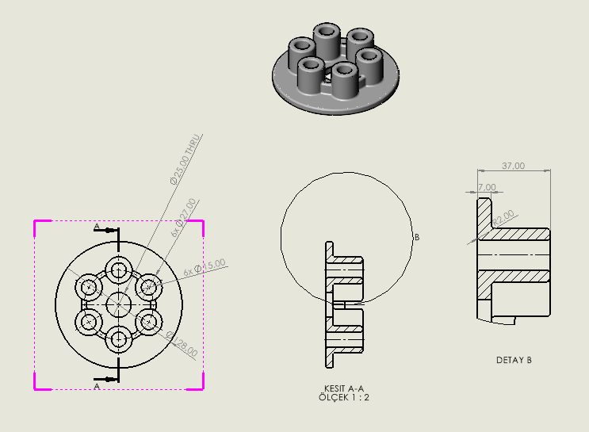

# Gün 2 — İlk Teknik Resmim

Dahili öğretici: `Başlarken > SOLIDWORKS'e Giriş > İlk Teknik Resmim`
Kaynak model: [Gün 1 — pressure_plate](../g01-pressure-plate/)
Tarih: 18 Ağustos 2026

## Yapılan görünümler

| Görünüm | Ayar |
|---|---|
| Üst görünüm | A (ANSI) Yatay sayfa, özel ölçek 1:2, Arka Kenarları Gizle |
| Kesit A-A | Dikey kesme çizgisi, plaka merkezinden, yönü ters çevrilmiş |
| Detay B | Kesit görünümü üzerinden, dairesel detay |
| İzometrik | Model Görünümü ile eklendi, gölgeli, 1:2 |

## Detaylandırma

- **Merkez işaretleri:** Bir silindirin dış kenarına eklenip çoğaltma simgesiyle diğer beşine yayıldı
- **Merkez çizgileri:** Kesit ve detay görünümlerinde delik kenar çiftleri seçilerek, toplam 4 adet
- **Ölçüler:** Ø128, Ø27, Ø25, Ø15 (üst görünüm) + 37, 7 ve detay ölçüleri (Detay B)
- **Ölçü metni düzenleme:** `<MOD-DIAM>` önüne `6x` yazılarak altı adet olduğu belirtildi; `<DIM>` arkasına `THRU` eklenerek merkez deliğin boydan boya olduğu gösterildi

## Öğrendiklerim

**1. Teknik resim modelden türetiliyor, ayrı çizilmiyor.**
AutoCAD'de görünümleri tek tek çizerdim. Burada model değişirse tüm görünümler, kesitler ve ölçüler kendiliğinden güncelleniyor. Teknik resim modelin bir **çıktısı**, ayrı bir belge değil.

**2. Ölçü metni, ölçünün kendisinden ayrı.**
`<MOD-DIAM>` ve `<DIM>` birer değişken; önüne ve arkasına metin eklenebiliyor. `6x Ø27` yazdığımda 27 değeri hâlâ modele bağlı — model değişirse sayı güncellenir, "6x" kalır. Bu, elle yazılmış bir metinden temelde farklı.

**3. Kesit görünümü bir çizgiyle tanımlanıyor.**
Kesme çizgisini nereye koyduğun kesitin ne göstereceğini belirliyor. Yönü ters çevirmek, hangi tarafın atıldığını değiştiriyor.

**4. Detay görünümü kesit üzerinden alınabiliyor.**
Detay B, doğrudan modelden değil, A-A kesitinden türetildi. Yani görünümler birbirinin üzerine kurulabiliyor.

**5. Belge ayarları çıktının okunabilirliğini belirliyor.**
`Teğet kenarları > Gösterme` ayarı radyuslu geçişlerdeki gereksiz çizgileri kaldırıyor. `Merkez işaretleri-delikler-parçalar` otomatik eklemesi kapatılıp elle eklendi — kontrolün sende olması için.

## Düzeltilecek

**Ölçü duyarlılığı.** Çıktımda ölçüler `Ø25.00`, `Ø27.00`, `Ø128.00` şeklinde iki ondalıklı görünüyor. Öğreticinin referansında ondalık yok (`Ø25 THRU`).
→ Düzeltme: `Tolerans/Duyarlılık > Birim Duyarlılığı` = **Hiçbiri**

**Detay B üçüncü ölçüsü.** Bende `12.00`, öğreticinin referansında `R2` (radyus ölçüsü) görünüyor. Farklı bir kenar ölçülmüş olabilir — kontrol edilecek.

## Değerlendirme

Öğretici rehberli takip edildi, hiçbir yerde takılma olmadı. Ancak **rehbersiz tekrar hâlâ yapılmadı** — Gün 1'den devreden görev duruyor.

Gün 1'in açık sorusu da cevaplanmadı: `Son Koşulu` açılır listesinde gerçekte kaç seçenek var, `Tümü Boyunca` ile `Her Şeyin İçinden` ayrı seçenekler mi?
