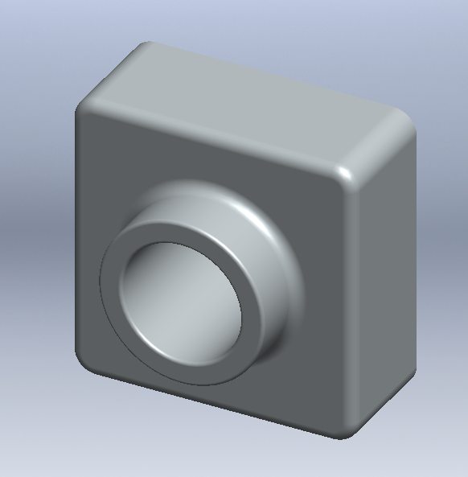
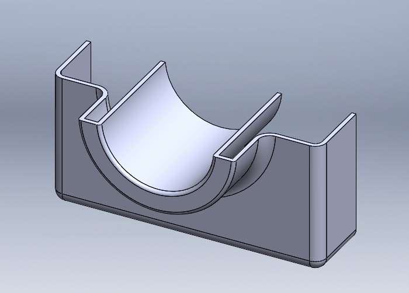

# Gün 3 — Ders 1: Parçalar (Tutor1)

Dahili öğretici: `Temel Teknikler > 1. Ders — Parçalar`
Tarih: 19 Ağustos 2026

## Unsur ağacı ve ölçüler

| # | Unsur | Ölçü / ayar | Not |
|---|---|---|---|
| 1 | Taban ekstrüzyonu | 120 × 120, derinlik 30 (Kör) | Ön düzlem, `Köşe ile Dikdörtgen`, bir köşesi orijinde |
| 2 | Yükseklik (boss) | Ø70, ön yüzde, üst kenardan 60 ve yan kenardan 60, derinlik 25 (Kör) | Konum ölçüyle sınırlandırıldı |
| 3 | Delik | Ø50, boss ön yüzünde, eşmerkezli, **Hepsinin İçinden** | Yarıçapı yükseklikten 10 mm küçük |
| 4 | `Fillet1` | R5 — taban ön yüzü + taban köşe kenarları (4 adet) | `Tam Önizleme` ile |
| 5 | `Fillet2` | R1,5 — yükseklik yüzü ve delik üst kenarları | |
| 6 | `Shell` | Arka yüz kaldırıldı, kalınlık 2 mm | |

## Düzenleme aşaması (öğreticinin asıl konusu)

Model tamamlandıktan sonra üç değişiklik yapıldı:

1. **Taban derinliği 30 → 50.** `Yükseklik-Ekstrüzyon1`e çift tıklanıp ölçü değiştirildi, `Yeniden Oluştur` ile model güncellendi. Tüm sonraki unsurlar kendiliğinden uyum sağladı.
2. **Taban radyusları ayrıştırıldı.** `Radyus1` içinde hem ön yüz hem köşe kenarları vardı. `Unsuru Düzenle` ile `Yüz<1>` silindi, kalan kenar radyusları R10'a çıkarıldı.
3. **Yüz radyusları geri eklendi — ama kabuktan önce.** Silinen ön yüz radyusu yeniden eklenirken **geri alma çubuğu** `Kabuk1` unsurunun üstüne sürüklendi, radyus orada eklendi, sonra çubuk serbest bırakıldı.

Son adım: `Gerçekçi Görünüm` (RealView) etkinleştirildi, malzeme olarak `Kromlu Paslanmaz Çelik` atandı.

## Öğrendiklerim

**1. Geri alma çubuğu = zamanda geri gitmek.**
Bu, günün en önemli kavramı. Radyusu kabuktan sonra eklersen kabuk o bölgeye uygulanmamış olur — çünkü kabuk zaten hesaplanmıştır. Çubuğu `Kabuk1`in üstüne çekip radyusu oraya eklediğinde, unsur ağacında **geçmişe** bir unsur yerleştirmiş oluyorsun ve kabuk yeniden hesaplanırken onu da kapsıyor.

Sonuç: **Unsur ağacı bir liste değil, bir işlem sırası.** Sıra değişirse sonuç değişir.

**2. Bir radyus unsuru birden çok öğe taşıyabilir — ve bu sorun olabilir.**
`Radyus1` hem ön yüzü hem dört köşe kenarını içeriyordu. Sadece kenarların yarıçapını değiştirmek istediğimde tek tek ayıramadım; önce yüzü unsurdan silmem gerekti. Ders: **birlikte değişmeyecek öğeleri aynı unsura koyma.**

**3. Model değişimi zincirleme yayılıyor.**
Taban derinliği 30'dan 50'ye çıktığında boss, delik, radyuslar ve kabuk hiçbiri kırılmadı. Design intent doğru kurulduğunda değişiklik ucuz oluyor.

**4. Kesit görünümü modeli kesmiyor.**
`Kesit Görünümü` sadece ekrandaki görüntüyü kesiyor; model olduğu gibi kalıyor. Kabuğun içini kontrol etmek için kullanıldı.

**5. Sketch'i sınırlandırmak = ölçü + ilişki.**
Daire önce serbest çizildi, sonra çap (Ø70) ve iki konum ölçüsü (60, 60) eklendi. Öğretici bunu açıkça belirtiyor: daire siyaha döndüğünde ve durum çubuğu tam tanımlı yazdığında sketch bitmiş sayılıyor.

## Bulgu: "Son Koşulu" çeviri tutarsızlığı

Aynı öğretici serisinde, tek bir ekstrüzyon seçeneği için **üç farklı Türkçe karşılık** kullanılıyor:

| Öğretici | Kullanılan ifade |
|---|---|
| İlk Parçam — merkez delik | Tümü Boyunca |
| İlk Parçam — silindir deliği | Her Şeyin İçinden |
| Ders 1 — Ø50 delik | Hepsinin İçinden |

Üçü de aynı işi yapıyor: seçilen yönde malzemenin tamamını kesmek. İngilizce karşılığı `Through All`.

**Sonuç:** Bu üç ifade ayrı seçenekler değil, aynı seçeneğin tutarsız çevirileri. Kesin doğrulama için `Ekstrüzyon ile Kes > Son Koşulu` açılır listesindeki madde sayısına bakılacak.

Bu, arayüzü Gün 15'te İngilizce'ye çevirme kararını destekleyen somut bir gerekçe: `Through All` tek isimdir, belirsizlik yoktur.

## Değerlendirme

Öğretici rehberli takip edildi, takılma olmadı.

**Devreden görev:** `pressure_plate`'in rehbersiz tekrarı üçüncü güne kaldı.
